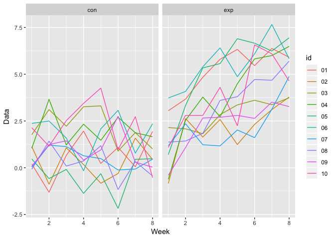

p8105\_hw5\_rm3609
================
Runqi Ma
2018/11/9

Problem 1
=========

Create a tidy dataframe containing data from all participants, including the subject ID, arm, and observations over time: Start with a dataframe containing all file names; the list.files function will help

``` r
long_data =
  tibble(
  files_name = list.files(path = "./data"))
```

Iterate over file names and read in data for each subject using purrr::map and saving the result as a new variable in the dataframe

``` r
read_data = function(path){
  read.csv(str_c("./data/", path))
           }

long_data = 
  long_data %>%  
  mutate(data = map(long_data$files_name, read_data))

long_data
```

    ## # A tibble: 20 x 2
    ##    files_name data                
    ##    <chr>      <list>              
    ##  1 con_01.csv <data.frame [1 × 8]>
    ##  2 con_02.csv <data.frame [1 × 8]>
    ##  3 con_03.csv <data.frame [1 × 8]>
    ##  4 con_04.csv <data.frame [1 × 8]>
    ##  5 con_05.csv <data.frame [1 × 8]>
    ##  6 con_06.csv <data.frame [1 × 8]>
    ##  7 con_07.csv <data.frame [1 × 8]>
    ##  8 con_08.csv <data.frame [1 × 8]>
    ##  9 con_09.csv <data.frame [1 × 8]>
    ## 10 con_10.csv <data.frame [1 × 8]>
    ## 11 exp_01.csv <data.frame [1 × 8]>
    ## 12 exp_02.csv <data.frame [1 × 8]>
    ## 13 exp_03.csv <data.frame [1 × 8]>
    ## 14 exp_04.csv <data.frame [1 × 8]>
    ## 15 exp_05.csv <data.frame [1 × 8]>
    ## 16 exp_06.csv <data.frame [1 × 8]>
    ## 17 exp_07.csv <data.frame [1 × 8]>
    ## 18 exp_08.csv <data.frame [1 × 8]>
    ## 19 exp_09.csv <data.frame [1 × 8]>
    ## 20 exp_10.csv <data.frame [1 × 8]>

Tidy the result; manipulate file names to include control arm and subject ID, make sure weekly observations are “tidy”, and do any other tidying that’s necessary

``` r
long_data = 
  long_data %>%  
  unnest() %>% 
  janitor::clean_names() %>% 
  gather(key = week, value = data, week_1:week_8) %>% 
  separate(files_name, into = c("arm", "id"), sep = "_") %>% 
  mutate(id = str_replace(id, ".csv",""),
         week = str_replace(week, "week_", ""))

long_data
```

    ## # A tibble: 160 x 4
    ##    arm   id    week   data
    ##    <chr> <chr> <chr> <dbl>
    ##  1 con   01    1      0.2 
    ##  2 con   02    1      1.13
    ##  3 con   03    1      1.77
    ##  4 con   04    1      1.04
    ##  5 con   05    1      0.47
    ##  6 con   06    1      2.37
    ##  7 con   07    1      0.03
    ##  8 con   08    1     -0.08
    ##  9 con   09    1      0.08
    ## 10 con   10    1      2.14
    ## # ... with 150 more rows

Make a spaghetti plot showing observations on each subject over time, and comment on differences between groups.

``` r
  long_data %>% 
  ggplot(aes(x = as.numeric(week), y = data, color = id)) +
  geom_line() +
  facet_grid(~arm) +
  labs(
      x = "Week",
      y = "Data"
    )
```



Problem 2
=========

Describe the raw data.

``` r
homi_data = read.csv("./homicide-data.csv")
```

Create a city\_state variable (e.g. “Baltimore, MD”) and then summarize within cities to obtain the total number of homicides and the number of unsolved homicides (those for which the disposition is “Closed without arrest” or “Open/No arrest”).

``` r
homi_data =
  homi_data %>% 
  mutate(city_state = str_c(city, state, sep = ",")) 

n_homi = 
homi_data %>% 
  group_by(city_state) %>% 
  summarize(n_total = n(),
            n_unsolved = sum(disposition %in% c("Closed without arrest", "Open/No arrest")))
n_homi
```

    ## # A tibble: 51 x 3
    ##    city_state     n_total n_unsolved
    ##    <chr>            <int>      <int>
    ##  1 Albuquerque,NM     378        146
    ##  2 Atlanta,GA         973        373
    ##  3 Baltimore,MD      2827       1825
    ##  4 Baton Rouge,LA     424        196
    ##  5 Birmingham,AL      800        347
    ##  6 Boston,MA          614        310
    ##  7 Buffalo,NY         521        319
    ##  8 Charlotte,NC       687        206
    ##  9 Chicago,IL        5535       4073
    ## 10 Cincinnati,OH      694        309
    ## # ... with 41 more rows

For the city of Baltimore, MD, use the prop.test function to estimate the proportion of homicides that are unsolved; save the output of prop.test as an R object, apply the broom::tidy to this object and pull the estimated proportion and confidence intervals from the resulting tidy dataframe.

``` r
n_baltimore =
  n_homi %>% 
  filter(city_state == "Baltimore,MD") 

prop = 
  prop.test(n_baltimore$n_unsolved, n_baltimore$n_total) %>% 
  broom::tidy() %>% 
  select(estimate, conf.low, conf.high)

prop
```

    ## # A tibble: 1 x 3
    ##   estimate conf.low conf.high
    ##      <dbl>    <dbl>     <dbl>
    ## 1    0.646    0.628     0.663

Now run prop.test for each of the cities in your dataset, and extract both the proportion of unsolved homicides and the confidence interval for each. Do this within a “tidy” pipeline, making use of purrr::map, purrr::map2, list columns and unnest as necessary to create a tidy dataframe with estimated proportions and CIs for each city.

``` r
result = map2(.x = n_homi$n_unsolved,
     .y = n_homi$n_total,
     ~prop.test(.x, .y)) 
```

    ## Warning in prop.test(.x, .y): Chi-squared approximation may be incorrect

``` r
tidy = function(result){
  result %>% 
    broom::tidy()
} 

test_result = map(.x = result, ~tidy(.x)) %>% 
  bind_rows() %>% 
  select(estimate, conf.low, conf.high) %>% 
  mutate(city_state = n_homi$city_state)
```

Create a plot that shows the estimates and CIs for each city – check out geom\_errorbar for a way to add error bars based on the upper and lower limits. Organize cities according to the proportion of unsolved homicides.

``` r
test_result %>% 
  mutate(city_state = forcats::fct_reorder(city_state, estimate)) %>% 
  ggplot(aes(x = city_state, y = estimate)) +
  geom_point() +
  geom_errorbar(aes(ymin = conf.low, ymax = conf.high)) +
  theme(axis.text.x = element_text(angle = 90, hjust = 1))
```


